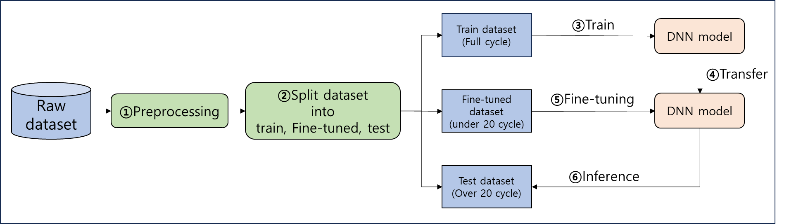
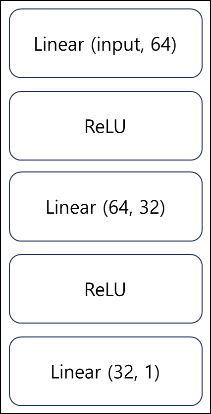
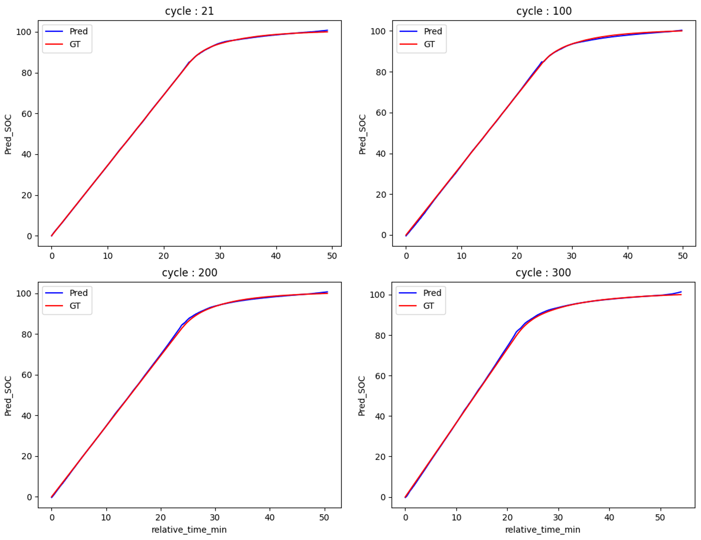

# 📄 Lithium-ion battery state of charge estimation 
A project to predict the later charging State of Charge (SOC) using initial charging cycle data from eight different batteries.


## 🔎 Overview

Train on data from seven batteries, then perform transfer learning using the first 20 cycles of the remaining test battery for fine-tuning, and finally predict the SOC up to 300 cycles.

<p align="center">  </p>

## ⚙️ Workflow

1. Data preprocessing.
2. Train the base model using data from seven batteries.
3. Fine-tune the base model with the remaining battery data (up to 20 cycles).
4. Predict the future SOC beyond 20 cycles.

## 📘 Model

A model built with dense layers
<p align="center">  </p>


## 📊 Code

```bash
# 1) Run the preprocessing code
bash prep.sh

# 2) Run the runinig code, 
bash run.sh

<run.sh>  #Please run the code one by one.
#train
python ./src/run.py --input ./data --test_id 7 --early_stop 30 --epoch 1000 --test_cycle 20 --run_type train --output ./result --try_id 1 --resume checkpoint_file.ckpt
#fine tuning
python ./src/run.py --input ./data --test_id 7 --early_stop 30 --epoch 1000 --test_cycle 20 --run_type valid --output ./result --try_id 1 --model_weights checkpoint_file.ckpt
#test
python ./src/run.py --input ./data --test_id 7 --test_cycle 20 --run_type test --output ./result --try_id 1 --model_weights checkpoint_file.ckpt

#All data — including model checkpoints, parameters set in the bash script, and result logs — are stored in the output path.

```
| Argument | Type | Require | Description |
|----------|------|---------|-------------|
| --input | str | True | Data folder path |
| --test_id | int | True | Test file number of the input folder |
| --early_stop | int | True(default=30) | Model early stop |
| --epoch | int | True(default=1000) | Model training epoch |
| --test_cycle | int | True | Set the test cycle: use the data before this cycle for fine-tuning, and the data after this cycle for testing. |
| --run_type | str | True | Select operation type, one of {train, finetuning, test} |
| --model_weights | str | False | Ckpt path for finetuning and test operation |
| --output | str | True | Root path for saving everything |
| --try_id | int | True | Try_id |
| --resume | str | False | Checkpoint file path for resuming training |

---

## 📊 Result
---
The model achieved a **Mean Squared Error (MSE) of 0.20** and an **R-squared (R²) value of 0.99**.


<p align="center">  </p>


---
## 📂 Project Structure

``` bash
Battery_SoC/
├── model/DNN.py             # DNN model
├── src/mat_to_csv.py        # Convert mat file to csv
├── src/preprocessing.py     # Preprocess the CSV files
├── src/run.py               # Train, Fin-tuning, Test code 
├── src/utils.py             # Utils(etc functions) 
└── README.md
```

