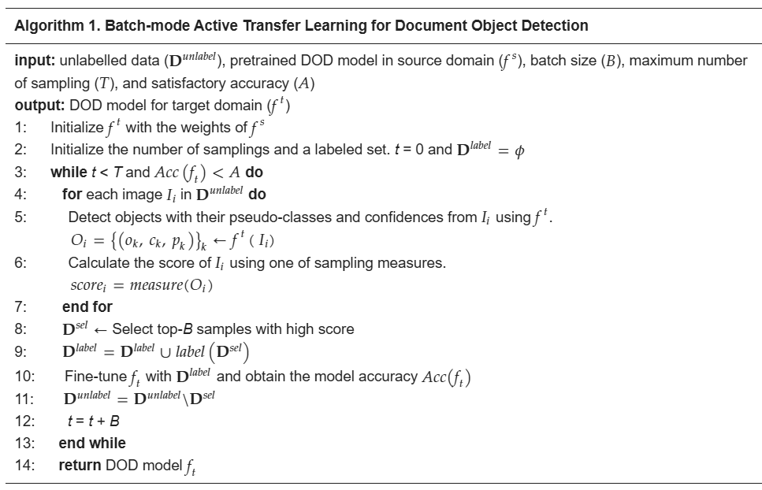

# 📄 Active Transfer Learning for Document Object Detection

This project explores Batch-mode Active Learning combined with Transfer Learning to improve Document Object Detection (DOD) with minimal labeled data.
By iteratively selecting and labeling only the most informative samples, the model achieves high accuracy while significantly reducing labeling cost.

## 🔎 Overview

Transfer Learning: Start from a pretrained document object detection model.

Uncertainty-based Active Learning: Identify and label samples with high uncertainty.

Batch-mode strategy: Select top-k informative samples per iteration.

Goal: Efficiently adapt a DOD model to new domains with limited manual labeling.

  

## ⚙️ Workflow

Transfer Learning Initialization
Load a pretrained DOD model from the source domain.

Inference & Evaluation
Run inference on unlabeled data and estimate sample uncertainty.

Batch-mode Active Learning
Select top-k samples, perform manual labeling, and expand the labeled dataset.

Fine-tuning & Iteration
Retrain the model with the updated dataset until performance reaches the desired threshold.

## 📘 Algorithm

Batch-mode Active Transfer Learning for Document Object Detection

### Pseudocode

  

## 📊 Example Results

  

Left: Original document image

Middle: Object detection with Transfer Learning

Right: Improved detection after Active Transfer Learning

## 📂 Project Structure

active_learning_object_detection/
├── ATL.py                   # Active learning loop function
├── ATLutils.py              # Utils - dataload,validation,inference
├── ITBDOD.py                # Model - FastserRCNN
├── main.ipynb               # Main script
├── Performance_Measures.py  # Measures - precision, recall, f1-score
└── README.md

## 📌 References

SHan Y-R, Park D, Han Y-S, Jung J-Y. Cost-Efficient Active Transfer Learning Framework for Object Detection from Engineering Documents. Processes. 2025; 13(6):1657. https://doi.org/10.3390/pr13061657

✨ This project highlights how active learning can reduce annotation costs while maintaining strong performance in real-world document analysis tasks.